# README.md

# CI/CD with ArgoCD, RBAC, Scanning, Linting & Monitoring  

  
  

This repository contains a **GitHub Actions CI/CD pipeline** for a containerized application with security, quality, and deployment automation. The workflow ensures code quality, scans for vulnerabilities, builds & pushes Docker images, and deploys the application to Kubernetes via **ArgoCD** with monitoring included.

---

## 📌 Workflow Overview

The pipeline runs on every push and pull request to the **`main`** branch.  

### 1. **Build, Test & Scan**
- **Python (backend)** → Lint & test with Flake8 + Pytest.  
- **Node.js (frontend)** → Install deps & run tests.  
- **SonarQube** → Code quality analysis.  
- **Docker** → Build container image.  
- **Trivy** → Scan image for HIGH/CRITICAL CVEs.  
- Push image to registry.  
- Update Kubernetes manifests repo with new image tag.  

### 2. **Deployment with ArgoCD**
- Configure ArgoCD accounts & RBAC.  
- Login and sync application manifests.  
- Deploy Prometheus, Grafana & Loki monitoring stack.  
- Verify application health status.  

---

## 🔐 Security Scanning

- **SonarQube** → Static code analysis (bugs, vulnerabilities, code smells).  
- **Trivy** → Container vulnerability scanning.  

Pipeline fails early on **HIGH/CRITICAL issues**.  

---

## ⚙️ Secrets Required

Add the following secrets in **GitHub → Repo → Settings → Secrets and variables → Actions**:

| Secret Name               | Description |
|----------------------------|-------------|
| `SONAR_HOST_URL`           | SonarQube server URL |
| `SONAR_TOKEN`              | Token for SonarQube authentication |
| `CONTAINER_REGISTRY`       | Container registry URL (e.g., ghcr.io, docker.io) |
| `REGISTRY_USERNAME`        | Registry username |
| `REGISTRY_PASSWORD`        | Registry password/token |
| `MANIFESTS_REPO`           | Repository containing Kubernetes manifests |
| `MANIFESTS_REPO_PAT`       | Personal Access Token for manifests repo |
| `KUSTOMIZE_PATH`           | Path to kustomization.yaml |
| `ARGOCD_ADMIN_PASSWORD`    | Password for ArgoCD `admin` account |
| `ARGOCD_DEV_PASSWORD`      | Password for developer user |
| `ARGOCD_OPS_PASSWORD`      | Password for operator user |

---

## 🚀 Deployment Flow Diagram

```mermaid
flowchart TD
    A[Developer Push to Main] --> B[GitHub Actions CI/CD]

    subgraph CI[Build, Test & Scan]
      B1[Checkout Code]
      B2[Python Lint & Test]
      B3[Node.js Lint & Test]
      B4[SonarQube Scan]
      B5[Docker Build]
      B6[Trivy Scan]
      B7[Push Image to Registry]
      B8[Update K8s Manifests Repo]
    end

    B --> CI

    CI --> D[ArgoCD Deployment]

    subgraph CD[ArgoCD Deploy & Monitor]
      D1[Configure Accounts & RBAC]
      D2[Login to ArgoCD]
      D3[Sync App]
      D4[Verify Health]
      D5[Deploy Monitoring Stack - Prometheus/Grafana/Loki]
    end

    D --> CD

    CD --> E[Application Healthy ✅]
```

---

## ⏱️ Sequence Diagram

---

## 📊 Monitoring

- **Prometheus** → Metrics collection.  
- **Grafana** → Dashboards for observability.  
- **Loki** → Centralized log aggregation.  

---

## ✅ Benefits

- Automated **linting, testing, and scanning**.  
- **Secure & reliable** container deployments.  
- GitOps with **ArgoCD + RBAC policies**.  
- **End-to-end observability** with monitoring stack.  

---
